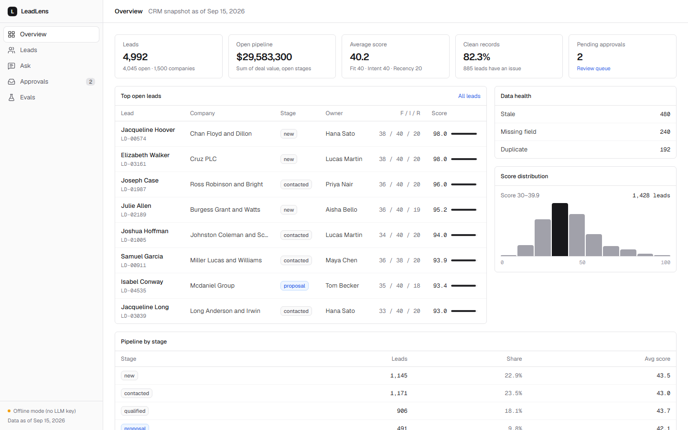

# LeadLens

LeadLens is a decision engine for messy CRM leads. It cleans the data, ranks every lead with a deterministic score you can explain, says why each lead is worth acting on now (citing exact CRM rows), answers plain-English questions with SQL, and holds every change for human approval.

**The core rule:** the LLM never computes a number. Scores, filters and aggregates come from Python and SQL. The LLM only writes SQL and phrases explanations. A checker verifies every ID and every number it writes against the query result. If a check fails, the answer is retried and then replaced with a deterministic one.



## Quickstart

Requires Python 3.11+ and Node 20+.

```bash
cd backend && python -m venv .venv && . .venv/bin/activate && pip install -r requirements.txt   # Windows: .venv\Scripts\activate
python -m app.seed && uvicorn app.main:app --reload            # API on :8000 (seeds ~5k leads in ~6s)
cd ../frontend && npm install && npm run dev                   # UI on :3000 (in a second terminal)
```

LLM keys are optional. Copy `.env.example` to `.env` and set `GROQ_API_KEY` (primary) and/or `GEMINI_API_KEY` (fallback). With no keys the app runs in **offline mode**: explanations and drafts come from templates, and questions go to a rule-based parser that declines anything it doesn't fully understand.

```bash
cd backend && pytest -q          # 83 tests
python -m evals.run              # golden eval + cleaning precision/recall -> evals/latest.json
```

### Before a demo (LLM quota)

Free-tier keys have small quotas (Groq: 8k tokens/min, 200k tokens/day on this model). LeadLens protects them in four ways:

- **Answer cache.** `/ask` and "why now" results are cached in DuckDB, keyed on the normalized question, a fingerprint of the prompts and model, and a data version. Approving an action or importing a CSV bumps the data version, so cached answers never describe stale data. Cached responses say `cached` and cost 0 tokens.
- **Compact prompts.** About 1,080 tokens per question, down from about 1,400 on the same questions. On list questions the answer payload is 82% smaller.
- **Rate limit.** 10 requests per minute per client on `/ask` and `/explain` (`LLM_RATE_LIMIT_PER_MIN`).
- **Call ledger.** Every provider call (purpose, tokens, latency, error) is appended to `backend/data/llm_calls.jsonl`.

```bash
python -m app.prewarm --api http://localhost:8000   # cache the demo questions shown on the Ask page
python -m app.llm_usage --since 2026-09-30           # tokens and errors from the ledger (UTC)
```

## What it does

| Screen | What you get |
|---|---|
| **Overview** | Lead counts, open pipeline, data health, score distribution, top open leads |
| **Leads** | Sortable, filterable table (server-side). Click a row (or <kbd>J</kbd>/<kbd>K</kbd> then <kbd>Enter</kbd>) for a drawer with the score breakdown, a cited "why now", data issues, activity and actions. <kbd>/</kbd> focuses search. |
| **Ask** | A plain-English question produces SQL, the result rows and an answer with citations. The SQL and rows are always shown, along with the verification result. |
| **Approvals** | Outreach drafts, duplicate merges and stage changes wait for a reviewer. Approving runs the change; every transition is in the audit log. |
| **Evals** | Golden-question accuracy, citation validity, latency, and cleaning precision/recall against injected ground truth |

Every ID in the UI (`LD-01234`, `ACT-38812`, `CO-00042`, `ISS-00165`) is a chip that opens its source row.

## How it works

```
backend/app/
  seed.py       synthetic CRM (seed=42) + injected issues + ground_truth.json
  cleaning.py   duplicate / stale / missing-field detection  -> data_issues
  scoring.py    fit + intent + recency, with the rows behind every point
  sql_guard.py  validates and sandboxes LLM-written SQL
  citations.py  rejects answers citing IDs or numbers not in the evidence
  ask.py        question -> SQL -> rows -> answer -> check -> retry/fallback
  rules.py      offline question parser (declines rather than guesses)
  explain.py    one-line "why now" + outreach drafts, checked, template fallback
  actions.py    approval queue, execution, audit log
  main.py       FastAPI
backend/evals/  50 golden questions, answers computed from reference SQL
frontend/       Next.js 14 App Router, Tailwind, TanStack Table/Query
```

### Data

About 5,000 leads, 1,500 companies and 40,000 activities, generated deterministically. Time is frozen at `2026-09-15 12:00` (`AS_OF`), so scores and evals are reproducible. Known problems are injected and recorded in `backend/data/ground_truth.json`:

- **Duplicates (4%)**: case changes, name typos, email typos, Gmail dot variants
- **Stale (10%)**: open stage with no contact for more than 90 days
- **Missing fields (5%)**: blank email, phone or title (as `NULL`, `""` or `" "`)

Duplicate detection normalizes emails (lowercase, Gmail dots and `+tags`), then fuzzy-matches name plus email local part within each company (rapidfuzz).

### Scoring (0–100)

| Component | Max | Inputs |
|---|---|---|
| Fit | 40 | seniority (16) + company size band (14) + industry match to ICP (10) |
| Intent | 40 | activities in the last 30 days, weighted by type (demo request 14, pricing visit 9, meeting 8, …), half-life 10 days, capped |
| Recency | 20 | follow-up urgency: low right after contact, peaks when 8–30 days overdue, decays as the lead goes cold. Closed leads score 0. |

Each point is attributed to a lead field, company field or activity ID. Those references are the citations shown in the drawer. The ICP and weights are in `backend/app/config.py`.

### Verification

1. **SQL guard**: exactly one `SELECT`, an allowlist of tables, blocked file and catalog functions, a 5s timeout, a 200-row cap, and execution inside a rolled-back transaction. The DuckDB connection also runs with `enable_external_access = false`, so no query can read files or URLs even if the checks were bypassed.
2. **Citation checker**: every `LD-/CO-/ACT-/ISS-` ID in an answer must appear in the result rows. Every number must match a value in the rows (rounding allowed), the row count, or a number from the question. Arithmetic done by the LLM (e.g. a sum of two scores) fails the check. If the rows contain IDs, the answer must cite at least one.
3. **Retry, then fall back**: bad SQL is retried up to 3 times with the error fed back. A rejected answer is retried once with the reason, and then replaced by a template summary built from the rows. The UI shows which path was taken.

### Approvals

Nothing changes CRM data until a reviewer approves it. Approval runs the action in a transaction:

- **Merge**: activities move to the primary lead, blank fields are filled, the duplicate is removed
- **Stage change**: updates the stage
- **Outreach**: sending is simulated; the contact is logged, so staleness and recency update

Scores and issues for the affected leads are then recomputed. Decided actions can't be decided again (409). A failed execution leaves the action `approved`, with the error recorded in the audit log.

## Results

Three runs of each mode. Method, per-run numbers, the failures found and fixed, and known limits are in **[docs/EVALS.md](docs/EVALS.md)**.

| Metric | Live LLM (Groq `gpt-oss-120b`) | Rule-based (offline) |
|---|---|---|
| Golden questions answered correctly | 50/50 in each of 3 runs* | 50/50 in each of 3 runs |
| Answers passing the citation checker | 100% | 100% |
| Retry rate (mean of 3 runs) | 0.7% | n/a |
| Latency p50 / p95, excluding rate-limit waits | about 3.3s / 5–6s (clean runs) | 8 ms / 14 ms |
| Duplicate / stale / missing-field detection P = R | 1.000 / 1.000 / 1.000 | same |

\* In run 3 the free-tier quota ran out and 17 questions fell back (14 to the rule-based parser). The model's own record is 50/50, 50/50 and 36/36.

Caveats:

- **The prompt fixes and the offline rules were developed against these 50 questions.** Treat the scores as "reliable on common analytics questions", not as proof of generalization. `tests/test_rules.py` has held-out and must-decline checks for offline mode.
- **Cleaning is perfect because the injected noise is synthetic.** Real CRM data would be harder.
- **The spec's `llama-3.3-70b-versatile` is no longer served by Groq,** so live results use `openai/gpt-oss-120b`.

## API

`GET /health` · `GET /overview` · `GET /leads?q&stage&owner&industry&issue&min_score&sort&order&page&page_size` · `GET /leads/{id}` · `POST /leads/{id}/explain` · `GET /rows/{id}` · `GET /issues?type` · `POST /ask {question}` · `GET /actions?status` · `GET /actions/{id}` · `POST /actions {type, lead_ids, payload?, note?, actor?}` · `POST /actions/{id}/approve|reject {actor, note?}` · `GET /evals/latest`

Interactive docs are at `http://localhost:8000/docs`.

## Deploy

- **API (Render)**: `render.yaml` is a blueprint. Set `GROQ_API_KEY`, `GEMINI_API_KEY` and `CORS_ORIGINS` (your Vercel URL). The build seeds the database.
- **UI (Vercel)**: set the root directory to `frontend` and `NEXT_PUBLIC_API_URL` to the Render URL.
- **CI**: `.github/workflows/ci.yml` runs pytest, an offline eval smoke run, lint, typecheck and the frontend build.

## Limitations

- No authentication. The reviewer name on the Approvals page is self-declared.
- Outreach is never actually sent.
- On Render's free tier the disk is ephemeral, so approvals reset when the service restarts or redeploys.
- The rule-based parser covers common counting, ranking, grouping and filter questions only. Anything else needs an LLM key.
