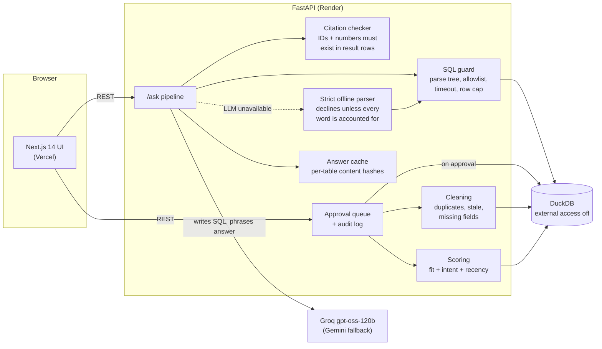

# LeadLens

LeadLens is a decision engine for messy CRM leads:

- **Cleans the data:** duplicates, stale records, missing fields.
- **Ranks every lead** with a deterministic score you can explain.
- **Says why a lead is worth acting on now,** citing exact CRM rows.
- **Answers plain-English questions** with visible SQL.
- **Holds every change for human approval.**

**The core rule:** the LLM never computes a number. Scores, filters and aggregates come from Python and SQL. The LLM only writes SQL and phrases explanations, and a checker verifies every row ID and every number it writes against the query result. If a check fails, the answer is retried, then replaced by a deterministic one. When no model is available, a strict offline parser answers only the questions it fully understands and declines the rest.


## Quickstart

Requires Python 3.11+ and Node 20+. Run from the repository root; the second and third commands need their own terminals.

```bash
cd backend && python -m venv .venv && .venv/bin/pip install -r requirements.txt   # Windows: .venv\Scripts\pip
cd backend && .venv/bin/uvicorn app.main:app      # API on :8000; builds the seed-42 dataset (~6s) on first start
cd frontend && npm install && npm run dev         # UI on http://localhost:3000
```

LLM keys are optional. Copy `.env.example` to `backend/.env` and set `GROQ_API_KEY` (primary) and/or `GEMINI_API_KEY` (fallback). With no keys the app runs in **offline mode**: "why now" notes and drafts come from templates, and questions go to the strict rule-based parser. The top bar always shows which mode is answering.

```bash
cd backend && .venv/bin/pytest -q                   # 164 tests, no network needed
.venv/bin/python -m evals.run --mode offline        # golden eval + cleaning precision/recall
```

## Architecture



**A question's path:** cache lookup → the LLM writes SQL → the guard validates it → DuckDB runs it read-only → the LLM phrases an answer from the rows → the checker verifies every ID and number → the answer is shown with its SQL and rows.
- Bad SQL is retried with the error and the rejected query fed back.
- A rejected answer is retried once, then replaced by a template built from the rows.
- If the LLM fails outright, the offline parser answers or declines.

## What it does

| Screen | What you get |
|---|---|
| **Overview** | Lead counts, open pipeline, data health, score distribution, top open leads, **Import CSV** |
| **Leads** | Sortable, filterable table. Click a row (or <kbd>J</kbd>/<kbd>K</kbd>, <kbd>Enter</kbd>) for the score breakdown, a cited "why now", data issues, activity and actions. <kbd>/</kbd> focuses search. |
| **Ask** | Plain-English question → SQL → rows → cited answer, with the verification result and the path that produced it |
| **Approvals** | Outreach drafts, duplicate merges and stage changes wait for a reviewer; approving executes and audits |
| **Evals** | Golden-question accuracy, citation validity, retry/fallback rates, latency, cleaning precision/recall |

Every ID in the UI (`LD-01234`, `ACT-38812`, `CO-00042`) is a chip that opens its source row.

### Data

About 5,000 leads, 1,500 companies and 40,000 activities, generated deterministically (seed 42) with time frozen at `2026-09-15 12:00`, so every score and eval is reproducible. Known problems are injected and recorded in `backend/data/ground_truth.json`: 4% duplicates, 10% stale, 5% missing fields.

**CSV import** accepts HubSpot/Salesforce-style exports:
1. It proposes a column mapping for you to confirm.
2. It rejects bad rows with a reason each.
3. It matches companies by domain.
4. It re-runs duplicate detection across old and new leads, and scores the new ones.

Try it with `backend/data/sample_hubspot_export.csv`.

### Scoring (0–100)

| Component | Max | Inputs |
|---|---|---|
| Fit | 40 | seniority (16) + company size (14) + industry match to the ICP (10) |
| Intent | 40 | activities in the last 30 days, weighted by type (demo request 14, pricing visit 9, meeting 8, …), 10-day half-life |
| Recency | 20 | follow-up urgency: low right after contact, highest when 8–30 days overdue, decaying as the lead goes cold |

Every point is attributed to a lead field, company field or activity ID, and those are the citations shown in the UI.

### Safety and verification

- **SQL guard:**
  - Allows one `SELECT`, over allowlisted tables only, found by walking DuckDB's parse tree.
  - Rejects table functions, and CTEs named after protected tables.
  - Runs with a 5-second timeout, a 200-row cap, and inside a rolled-back transaction.
  - The connection itself has `enable_external_access = false`.
- **Citation checker:**
  - Cited IDs must be in the result rows, and square brackets may only hold real row IDs.
  - Every number must appear in the rows, be the row count, or come from the question. Arithmetic by the LLM fails the check.
- **Approvals:** nothing changes CRM data until a person approves. Merges, stage changes and (simulated) outreach execute in a transaction, and every step is audited.

### Quota protection

The free Groq tier allows 8k tokens per minute and 200k per day on this model. LeadLens protects that budget in five ways:

- **Answer cache.**
  - `/ask` and "why now" results are cached, keyed on the normalized question and a fingerprint of the prompts and model.
  - Each entry records a content hash of every table its SQL read, and is served only while those tables are unchanged.
  - Proposing or rejecting an action invalidates nothing. An approved stage change invalidates lead questions but not a companies-only question.
- **Reset demo data** (sidebar): rebuilds the seed-42 database and reloads `backend/data/answer_cache_seed.json`. Content hashes make that seed valid again after every reset.
- **Compact prompts:** about 1,080 tokens per question, down from about 1,400.
- **Rate limit:** 10 requests per minute per client on LLM endpoints.
- **Call ledger:** every provider call is logged in `backend/data/llm_calls.jsonl` (`python -m app.llm_usage`).

```bash
python -m app.prewarm --reset --export   # with the API stopped: answer the demo questions, write the cache seed
```

## Evaluation

Full method, per-run numbers, every failure found and how it was fixed: **[docs/EVALS.md](docs/EVALS.md)**. All numbers come from committed JSON reports.

| | Live LLM (Groq `openai/gpt-oss-120b`) | Offline rule-based parser |
|---|---|---|
| **Golden set** (50 questions, used during development) | 50/50 in each of 3 runs, 100% citation-checker pass¹ | 50/50² |
| **Held-out set** (25 new questions, never tuned on) | **not yet run**³ | 4/25 correct, **0 wrong**; 21 declined⁴ |
| Latency p50 / p95, excluding rate-limit waits | about 3.3s / 5–6s | under 40 ms |

| Cleaning | Precision | Recall |
|---|---|---|
| Seeded data (noise designed alongside the detector) | 1.00 | 1.00 |
| **Held-out duplicate set, detector untouched** | **0.90** | **0.30** |
| Same set after general fixes (no longer held-out) | 1.00 | 1.00 |

1. In run 3 the daily quota ran out and 17 questions fell back, so the model's own record is 50/50, 50/50 and 36/36. These runs used the prompts from before compaction; the compacted prompts have only been re-verified on the first 15 golden questions.
2. The offline parser was developed against these questions, so this is an upper bound.
3. Blocked by the provider's daily token limit; it will be run once, unchanged, and reported as-is.
4. Before the strict-fallback policy, the parser scored 5/25 but gave **3 confident wrong answers** (a ranking measure and a negation silently dropped). It now declines instead, at the cost of one question it used to answer correctly.

## Deploy

Render (API) + Vercel (UI), free tiers. The step-by-step guide is in **[docs/DEPLOY.md](docs/DEPLOY.md)**.
- On startup the API builds the dataset if it's missing and loads the answer-cache seed.
- `/health` reports data and cache readiness.
- The UI shows "Waking up server (~30s)" while a sleeping free instance starts.

CI (`.github/workflows/ci.yml`) runs pytest, an offline eval, lint, typecheck and the production build. It never calls an LLM.

## Limitations

- **Synthetic data.** Real CRM noise (initials, job changes, transliterations) is harder than both the seeded and the held-out cleaning sets.
- **The offline parser declines most questions** outside its small vocabulary. It's a safety net, not a substitute for the model.
- **The checker verifies support, not correctness.** An answer can quote the right rows and still describe them wrongly. Grading on returned rows covers the SQL, not the prose.
- **No authentication.** The reviewer name is self-declared, and "Reset demo data" is open to anyone on the deployment (set `DEMO_RESET_ENABLED=false` to disable it).
- **Outreach is simulated;** no email is sent.
- **Render's free disk is ephemeral:** approvals and imports reset on redeploy or restart.
- **Single process.** The rate limiter and DuckDB (a single writer) assume one API instance.
- **Model substitution.** The spec's `llama-3.3-70b-versatile` is no longer served by Groq, so live results use `openai/gpt-oss-120b`.

## AI tools used

- **Claude Code** (Anthropic's coding agent, model Claude Opus 5.5) built this project under the author's direction. It wrote most of the code, tests and documentation, ran the evaluations, and diagnosed the failures recorded in docs/EVALS.md.
- **Runtime models:**
  - Groq `openai/gpt-oss-120b` (reasoning effort `low`) writes SQL and phrases answers and "why now" notes.
  - Google `gemini-3.8-flash` is the fallback provider.
  - Neither computes scores or numbers.
- **Faker** generates the synthetic CRM data.

## API

`GET /health` · `GET /overview` · `GET /leads` · `GET /leads/{id}` · `POST /leads/{id}/explain` · `GET /rows/{id}` · `GET /issues` · `POST /ask` · `GET /ask/examples` · `GET /actions` · `POST /actions` · `POST /actions/{id}/approve|reject` · `POST /import/preview` · `POST /import` · `POST /admin/reset-demo` · `GET /evals/latest`. Interactive docs are at `/docs`.
